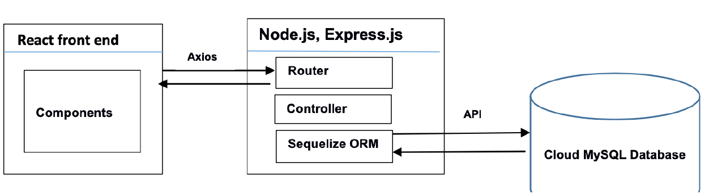
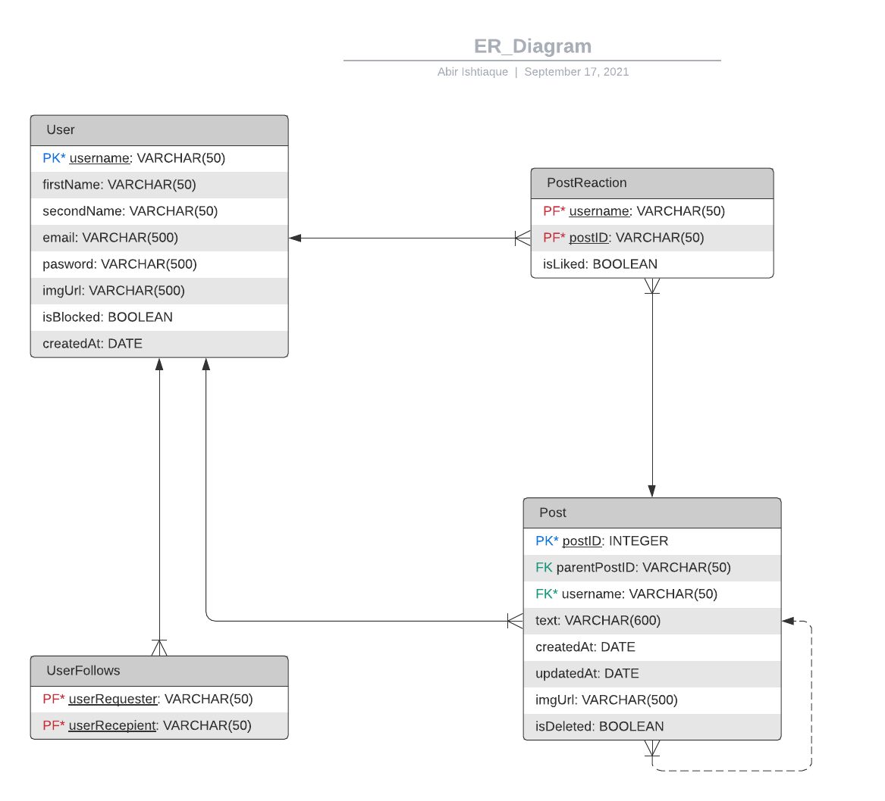

# VibeCheck-A2
Full Stack Development application for Further Web Programming semester 2 2021.

## How to run
After cloning, install dependencies with
<code>npm install</code>

Run the api first and then the frontend with 
<code>npm start</code>

## App Architecure

## Database Design

## Admin Functionalities
Start the admin-backend (GRAPHQL API) first and then the admin-app (React fronted) with the same 
<code>npm start</code>

<ul>
<li>Admin can update and block users.</li>
<li>Admin is able to delete posts</li>
</ul>
 

React-Chart.Js was used to display graphs.
<ul>
<li>Admin can view popular posts. Posts are ranked by a popularity score which is measured by likes/dislikes and replies.  Each like increases point by 1. Each reply increases point by 2. If post has more dislikes than likes 2 points are deducted from score</li>
</ul>

