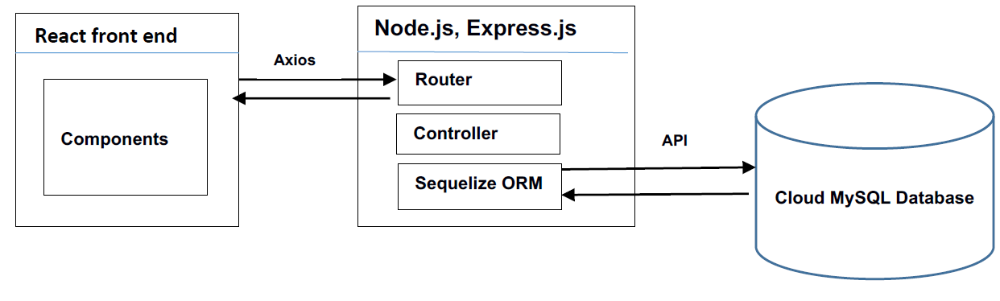
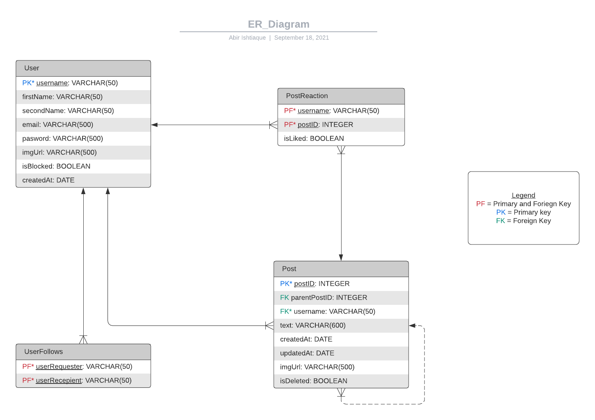

# VibeCheck-A2
Full Stack Development application for Further Web Programming semester 2 2021.

## How to run
After cloning, install dependencies with
<code>npm install</code>

Run the api first and then the frontend with 
<code>npm start</code>

## App Architecure

## Database Design

